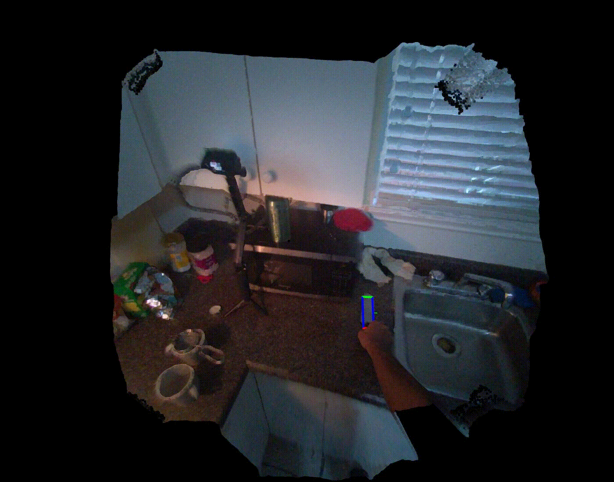

# Generating 6DoF Object Manipulation Trajectories from Action Description in Egocentric Vision


> [**Gnerating 6DoF Object Manipulation Trajecotries from Action Description in Egocentric Vision**](https://biscue5.github.io/egoscaler-project-page/),  
> Tomoya Yoshida\*, Shuhei Kurita, Taichi Nishimura, Shinsuke Mori, 
> CVPR 2025,
> *Paper at [arxiv](https://arxiv.org/abs/2506.03605)*  

## News
- [ ] Release codes and dataset. *(Code cleanup in progress)*
- [x] `05.04.2025`: Selected as Highlight Paper!
- [x] `27.02.2025`: Accepted at CVPR 2025!

## 🛠️ Installation

Follow the steps below to set up the environment.

### 1. Clone this repository
```bash
# Clone with submodules
git clone --recursive https://github.com/your-username/EgoScaler.git
cd EgoScaler

# If you already cloned without --recursive, run this to fetch submodules
git submodule update --init --recursive
```

### 2. Create a Conda Environment

```bash
# Python version 3.8 or higher is required
conda create -n egoscaler python=3.8.17
conda activate egoscaler

# Run this under the root directory of the EgoScaler repository
pip install -e .
```

### 3. Install pytorch, torchvision
```bash
# Experiments were conducted using CUDA 11.8
conda install pytorch==2.3.1 torchvision==0.18.1 torchaudio==2.3.1 pytorch-cuda=11.8 -c pytorch -c nvidia
```

## Dataset Construction

We release both the dataset and the processing code to facilitate reproducibility.

- 📄 **Instructions:** Please follow the guide in [`egoscaler/data/README.md`](./egoscaler/data/README.md).
- 📦 **Dataset:** *(Coming soon.)*

## Train/Eval Models

We provide both training/evaluation code and pretrained checkpoints for reproducibility.

- 🧠 **Code:** Please follow the guide in [`egoscaler/models/README.md`](./egoscaler/models/README.md).
- 📍 **Checkpoints:** *(Coming soon.)*

## Demo
1. Visualize extracted trajectories.

Output trajectory with point cloud as video.

```bash
python vis/video.py
```
Here's the expected output.



2. Generate object trajecotries.

Draw trajectory and point cloud using Open3D.

```bash
python vis/interactive.py
```

## Citation
If you find our work useful in your research, please consider citing:
```bibtex
@inproceedings{egoscaler,
    title={Generating 6DoF Object Manipulation Trajectories from Action Description in Egocentric Vision},
    author={Tomoya, Yoshida and Shuhei, Kurita and Taichi, Nishimura and Shinsuke, Mori},
    booktitle={Proceedings of the IEEE/CVF Conference on Computer Vision and Pattern Recognition (CVPR)},
    year={2025}
}
```